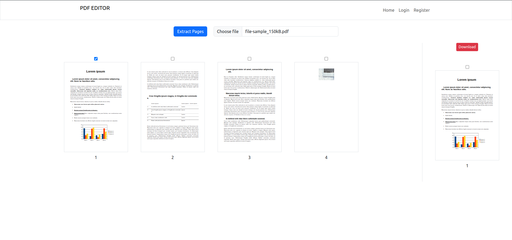
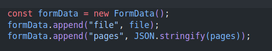

# pdf-editor

[Live Link](https://pdf-editor-client-ix32.onrender.com/)



## Run App : Local

To run the app locally on your computer clone the repo using following command.

```
git clone https://github.com/liju-ls/pdf-editor.git

```

After create a ".env" file in `/server` directory and set following values or anything you prefer except DBURI.

> PORT = 3001

> JWTSECRET = test

> DATABASE = pdf-editor

> COLLECTION = users

> DBURI = (your local or remote mongodb connection string host without database name)

> DEV_HOST = http://localhost:3001/

> NODE_ENV = development

After that install all the dependencies and run the development server using following commands.

```
cd server
npm i
npm run dev

cd ..

cd client
npm i
npm run dev

```

## Usage

PDF Editor API capable of

> Extract pages from PDF pages

> Change Order of PDF pages

### Extract Pages

For extract pages send a request using following end point with FORMDATA as body.

`http://hostname/extract-pages`

(host name should be replaced by your server hostname or localhost:port if you running locally)



The request should carry a formdata object that contains a PDF with field named as **file: pdfname.pdf** and an array with page number needs to be named as **pages : [1, 2]**.

### Change Page Order

For extract pages send a request using following end point with FORMDATA as body.

`http://hostname/change-order`

(host name should be replaced by your server hostname or localhost:port if you running locally)


The request should carry a formdata object that contains a PDF with field named as **file: pdfname.pdf** and an array with page number in order how you want change the pdf page **order: [3, 2, 1]**.

> [!NOTE]
> Although the API cabale of changing page order the UI doesn't implemented yet. So it only work if you make request from locally using own code or using any API tester.
